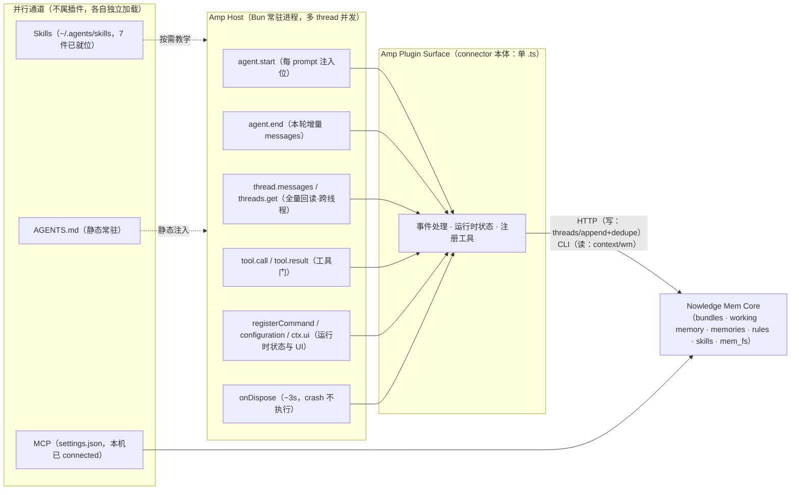

# Amp 能力面（connector 视角）（2026-07-28）

> 视图文档：不载新事实，是 FACTS §5/§7.5（实测）与 `amp-plugin-architecture.md`（机制细节）的 connector 视角重组，与 abn 文章的「Key capabilities Nowledge Mem delivers」清单 + 架构图对仗。右列标注每项能力承接 S2 的哪条成功标准（C1–C7，见 `S2-PRODUCT-REQUIREMENTS-2026-07-28.md`）。

## Key capabilities Amp delivers（对一个 connector 而言）

| # | 能力 | 内容 | 承接 |
|---|---|---|---|
| 1 | **每轮注入位**（`agent.start`） | host 每次用户提交 prompt 无条件触发，可把内容拼进用户消息尾部（进 transcript；`display` 默认 false，用户不可见）。这是 Amp 上唯一的确定性注入原语——`session.start` 是 fire-and-forget，无注入能力 | C1 启动上下文、C5 语境切换生效点、候选 P4 流程重申；C7 的成本压力源 |
| 2 | **thread 一等对象** | `agent.end` 自带本轮增量 `messages`；`thread.messages()` 全量回读（单次 ≤20 条分页）；`threads.get` 可读取、控制其他 thread 并向其发消息 | C3 真实抓取、C4 最终一致（增量随轮可得，不等终局） |
| 3 | **工具门**（`tool.call` / `tool.result`） | 五种裁决：allow / modify / reject-and-continue / synthesize / error | 待拍板项 2（权限门）的原语，本期未定 |
| 4 | **运行时状态与 UI** | `registerCommand`（命令面板，可 setAvailability）、`amp.configuration`（项目/用户级配置读写）、`ctx.ui.*`（通知/确认/输入/选择）、`createStatusItem`（experimental） | C5 的开关载体（用户在会话内下达「换语境」指令的入口） |
| 5 | **Agent 扩展面** | `registerTool`（LLM 可调工具）、`createAgent` / `registerAgentMode`（子 agent 与自定义模式）、`amp.ai.ask/generate`（插件内调模型）、`amp.$`（Bun Shell） | 本期 C1–C7 未直接依赖；agent-to-agent 场景的储备 |
| 6 | **后台与远程** | `createWebhook`（durable、at-least-once、绑 Orb thread，experimental）；Orb 配置为 project 级 | 待拍板项 1（Orb），本期观察项 |
| 7 | **进程模型与终局** | 单 Bun 常驻进程服务多 thread 并发，事件全部 thread-scoped；`onDispose` 全插件约 3 秒预算，crash/SIGKILL 不执行 | C4 的设计压力源：终局不可靠 → 抓取不能押注「结束时一次做完」 |
| 8 | **安装层级** | project `.amp/plugins/*.ts` / user `~/.config/amp/plugins/*.ts` / workspace global（experimental）；单 .ts 文件即插件，无 manifest | C2 安装验收的落点 |

**插件拿不到的东西**（同样是能力面的一部分）：无插件级 MCP 注册（MCP 走 settings.json 并行存在）、无插件级 rules 通道（AGENTS.md 是独立机制）、无 compact/切换类 session 事件（pi 有，Amp 无——PI-READING §7）。

## 架构图（与 abn 的 Nowledge Mem Core 图对接）

对照读法：abn 图的右端是「Google Antigravity Plugin Surface」，本图把那个箱子换成 Amp 并摊开——nmem Core 一侧完全不变（这就是 S1 §1 的「价值面与 host 无关」）；变的只是 host 一侧有哪些口子、缺哪些口子。

## 出处

- FACTS `AMP-CONNECTOR-FACTS-2026-07-27.md` §5、§7.5（[实测]/[文档]）
- `amp-plugin-architecture.md`（机制细节与目录布局）
- `PI-CONNECTOR-CODE-READING-2026-07-28.md` §7（事件面缺口对照）
- 传输箭头上的读写取舍是 pi 官方样本的做法（PI-READING §5），仅作示意，S3 才定 Amp 的取舍
