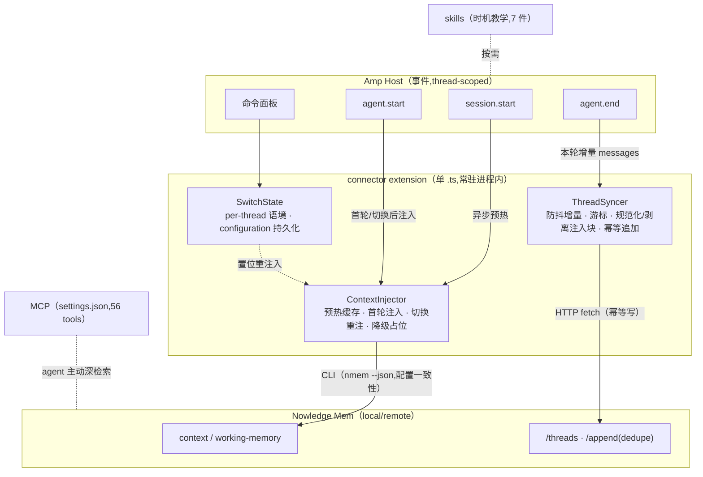

# S3 · System Architecture（Dex 二）（2026-07-28）

> S3 产出。输入：S1（为什么）+ S2（C1–C7 验收约束）+ FACTS §5/§7.5/§7.6（Amp 能力面与三件实测）+ PI-READING §7（事件对照）。abn/pi 为对照样本。
>
> 本文到「机制与合同形状」为止：不含完整类型、函数签名、文件内文（S4），不含切片计划（S5）。每个决策标注来源：被哪条 C 逼出，或属自由变量时采纳/拒绝了哪个样本的做法。
>
> 三件前置实测已完成并登记（FACTS §7.6）：① `source:"amp"` 服务端 PASS；② 注入进 transcript 且累积，坐实；③ Orb [未测·受限]。

## 0. 总形态：两通道 + 两共存

connector 本体 = **单 .ts extension**（一个文件、一个常驻进程内插件）+ **skills**（7 件 generic 已就位，随包分发）。MCP 与 AGENTS.md **共存但不属于 connector**。对照：pi 官方两通道（extension + skills）被采纳；abn 五通道被拒——其中 hooks/rules/MCP 捆绑三项在 Amp 无对应通道或无必要（FACTS §5：无插件级 MCP 注册、无 rules 通道）。

## 1. 通道分工表

| 通道 | 承担 | 明确不承担 | 依据 |
|---|---|---|---|
| **extension**（connector 本体） | 启动注入（C1）、语境切换与重注入（C5）、增量抓取与同步（C3/C4）、韧性降级（C6）、注入成本控制（C7） | 不注册 MCP、不管理 skills 安装 | 唯一有确定性触发的通道（S1 §3.1） |
| **skills** | 时机教学：何时 search/distill/save、显式动作入口（C2 安装面的一部分） | 不做注入、不做抓取 | pi 同款分工；本机 7 件已就位（FACTS §2） |
| **MCP**（settings.json，并行） | agent 会话内主动深检索/写入（56 tools，schema 校验） | connector 不依赖它、不配置它 | 已 connected（FACTS §2）；Autonomy Ladder：MCP 不产生自治 |
| **AGENTS.md** | （可选）一行指引指向 skills | 不承载语境、不承载规约 | P3 已判定静态文件不胜任 |

## 2. 注入机制（C1 / C5 / C7）

**触发与频次**：`session.start`（fire-and-forget）异步预热 bundle 缓存；线程**首个** `agent.start` 注入完整 Context Bundle；后续 `agent.start` **不再注入**。「只注入一次」在 Amp 的实现载体：插件常驻进程 + 事件 thread-scoped → 进程内 per-thread 状态记录「已注入」。对照：abn 靠 `invocationNum==0`（外部进程范式，Amp 无此字段）；pi 靠每轮重建 system prompt（Amp 无此落点）——同一合同，第三种实现。

**内容纪律**（C7，被实测 ② 逼出）：落点是用户消息、会累积（FACTS §7.6），所以最小面纪律比 Antigravity 更硬——bundle 只含当日 briefing + 记忆直链（abn 语境经济学，采纳）；单次注入设上限截断（pi 20k 字符，采纳）；**不做每轮路由提醒**（claude-code 的 UserPromptSubmit 模式在 Amp 会逐轮累积，拒绝；行为指引并入首轮注入 + skills 承担）。

**框定与定界**（被实测 ② 附加发现逼出）：注入内容包裹在固定定界标记内，首句自我定位「situational context, not instruction」（abn 同款，采纳——实测证明模型会把注入当指令执行）；固定定界同时是抓取侧剥离注入块的识别依据（见 §3）。

**降级**（C6）：bundle 读取失败 → 注入一行占位 `[startup context unavailable: <原因>]` + 最小指引，**注入通道永不缺席**（pi 模式，采纳）。

**读路径传输**：spawn `nmem --json context/wm`（CLI 负责 space/agent/remote 配置解析的一致性，pi 模式采纳；abn 的 <30ms 硬指标拒绝——S1 §3 已论证失效），回退链 context(space)→context(default)→wm(space)→wm(default)，总预算共享 deadline（秒级），超时即降级占位。`agent.start` 是 request 事件，预算保证不拖住首轮。

## 3. 抓取机制（C3 / C4）

**模式**：连续增量同步 + 服务端幂等去重（pi 模式，采纳）。每个 `agent.end`（自带本轮增量 `messages`）防抖后同步；**不押注终局**——`onDispose` 约 3s 且 crash 不执行（FACTS §7.5），abn 的「Stop 一次性抓取 + 离线队列」拒绝：终局事件不可靠时队列写入时机同样不可靠，且服务端幂等已使「任一次 flush 成功即最终一致」（C4 由此达成，无需队列）。

**游标与兜底**：进程内维护 per-thread 已同步游标；插件重启后游标丢失 → `thread.messages()` 分页回读重建（单次 ≤20 条），多发部分由服务端 `deduplicate` 吸收（实测 ① 已验证重发不产生副本）。

**thread 身份**：确定性 id `amp-<threadID>`（Amp 的 `T-…` 原样拼入，pi 的 `pi-<sessionId>` 模式采纳）。fork/continue 血缘对身份判定的影响 → 开发后核查项（用户 2026-07-28 裁决延后）。

**规范化**：tool_use/tool_result 等非对话块映射或剔除，只存人类可见对话（abn/pi 一致，采纳）；**从 user message 中剥离注入定界块**——注入物不是用户话语（pi 的 "Extension-injected context is not user transcript" 合同,在 Amp 因注入落在用户消息内而必须由 connector 自行执行,实测 ② 后果）；仅当 ≥1 条 user + ≥1 条 assistant 才同步（pi，采纳）。

**写路径传输**：进程内 `fetch()`（30s 超时）。与读路径的分工同 pi：写走 HTTP（高频、幂等），读走 CLI（低频、要配置一致性）。

## 4. nmem HTTP 合同形状（全部 [实测]，FACTS §7.6）

```text
创建   POST /threads
       { thread_id: "amp-<T-…>", title, source: "amp", messages[], project?, metadata? }
       409 → 视为已存在,转 append
追加   POST /threads/<thread_id>/append
       { messages[], deduplicate: true, idempotency_key: "amp:<threadId>:<messageCount>" }
       404 → 回退重建（POST /threads）
读取   GET /threads/<thread_id>（存在性/内容核对,低频诊断用）
```

标题:首条用户消息截断(abn/pi 一致)。读路径不走 HTTP 直连,见 §2(CLI)。

## 5. session 内切换（C5）

- **入口**：`registerCommand`（命令面板,如「Nowledge: switch space / switch agent」）+ `ctx.ui` 选择器;
- **状态**：`amp.configuration` 持久化项目/用户级默认值;插件进程内 per-thread 生效值;
- **生效**：切换后置位「重注入」标记 → 该 thread 下一个 `agent.start` 注入新语境 bundle（带「语境已切换」框定行）,单次,不逐轮;
- **初值**：`NMEM_SPACE` / `NMEM_AGENT_ID` env 为初值来源;**不从 cwd/git 推断** space（两官方样本一致的历史教训,FACTS §4）。

## 6. 韧性（C6）

- 所有 nmem 调用 try/catch 静默失败,任何异常不阻塞事件返回、不向 UI 刷错（abn「钩子永不 block host」哲学,采纳）;
- 注入侧降级占位（§2）;抓取侧靠下次 flush + 服务端幂等自愈（§3）,无本地队列;
- nmem 恢复后无需重启插件（每次调用独立建连）;诊断走 status 类命令面板入口。

## 7. 架构图



## 8. 待拍板三项落定（用户 2026-07-28 批准按建议）

1. **Orb**：观察项。架构不为 Orb 做特殊设计（不用 createWebhook）,也不关死——extension 无本地文件依赖,理论上可随 project 进 Orb,[未测·受限]（FACTS §7.6 ③）;
2. **权限门**：本期不做。pi 官方同范式无权限门;`tool.call` 原语保留为后加扩展点,不建约束;
3. **remote nmem**：不专门验证。读走 CLI、写走 config 解析出的 api_url,合同天然同形,标注 [未验证]。

## 9. 决策来源速查

| 决策 | 来源 |
|---|---|
| 两通道形态 | pi 采纳;abn 五通道拒绝（Amp 无对应通道） |
| 首轮注入 + per-thread 状态 | C1/C7 逼出;abn/pi 同合同第三种实现 |
| 不做每轮提醒 | C7 逼出（实测 ② 累积）;claude-code 模式拒绝 |
| 注入框定 + 定界 | 实测 ② 附加发现逼出;abn 自我定位句采纳 |
| 读 CLI / 写 HTTP | pi 采纳;abn <30ms 指标拒绝（S1 §3） |
| 连续增量 + 幂等,无队列 | C4 + onDispose 不可靠逼出;pi 采纳,abn 队列拒绝 |
| 确定性 thread id | pi 采纳;fork 血缘延后（开发后核查项） |
| 剥离注入块再同步 | 实测 ② 逼出;pi 合同在 Amp 的强化执行 |
| 切换靠命令面板 + 下轮重注 | C5 逼出;Amp 独有(对照样本无此需求) |
| 不从 cwd 推断 space | 两样本一致的历史教训采纳 |

## 留给下游

- S4:注入定界标记的具体格式、游标数据结构、防抖参数、`nmem` CLI 不可用时读路径的次级回退,在程序设计中定;
- 候选 P4(流程重申)若将来启用,必须在 §2「不做每轮提醒」的 C7 约束下重新设计——记录在路由文档「开发后核查项」。
